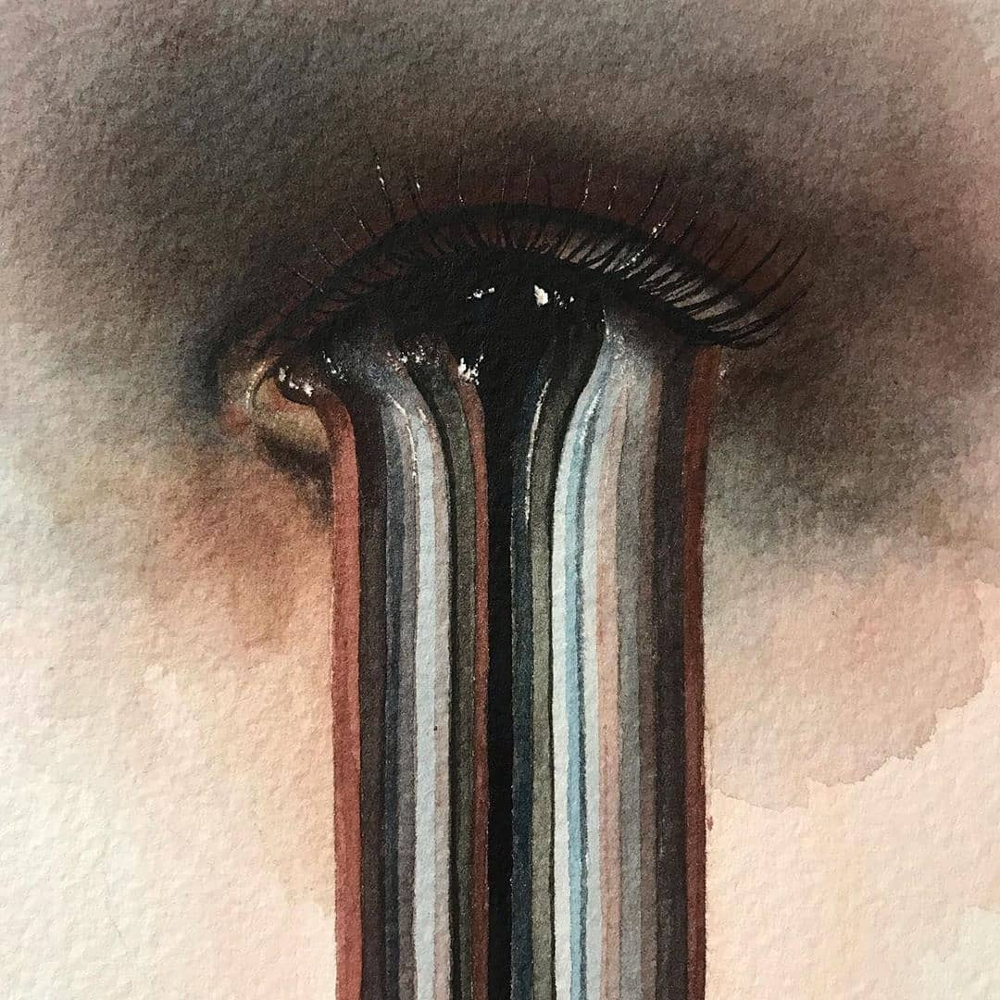
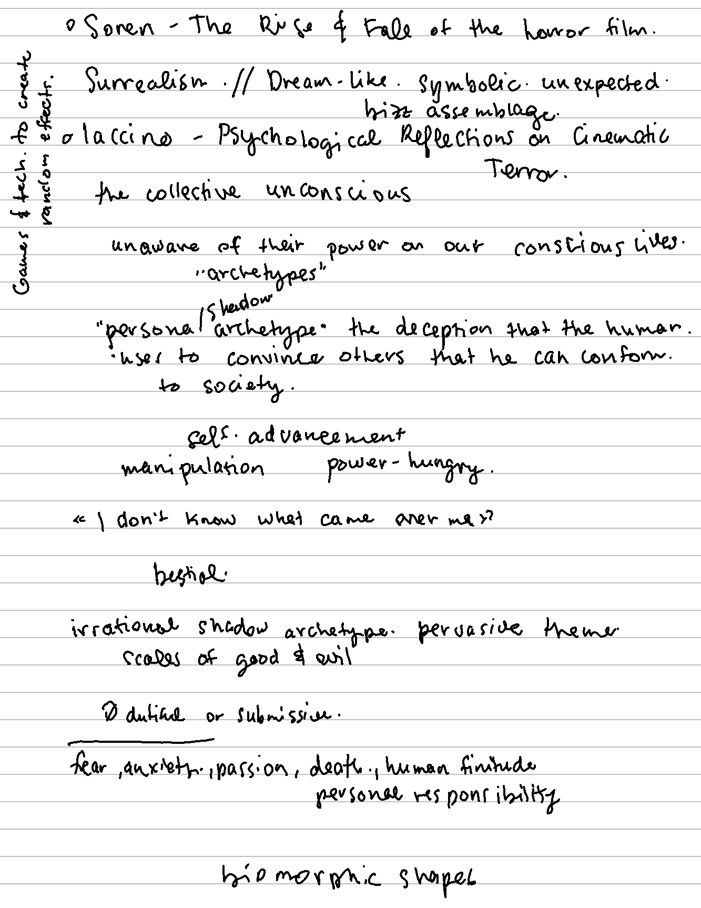
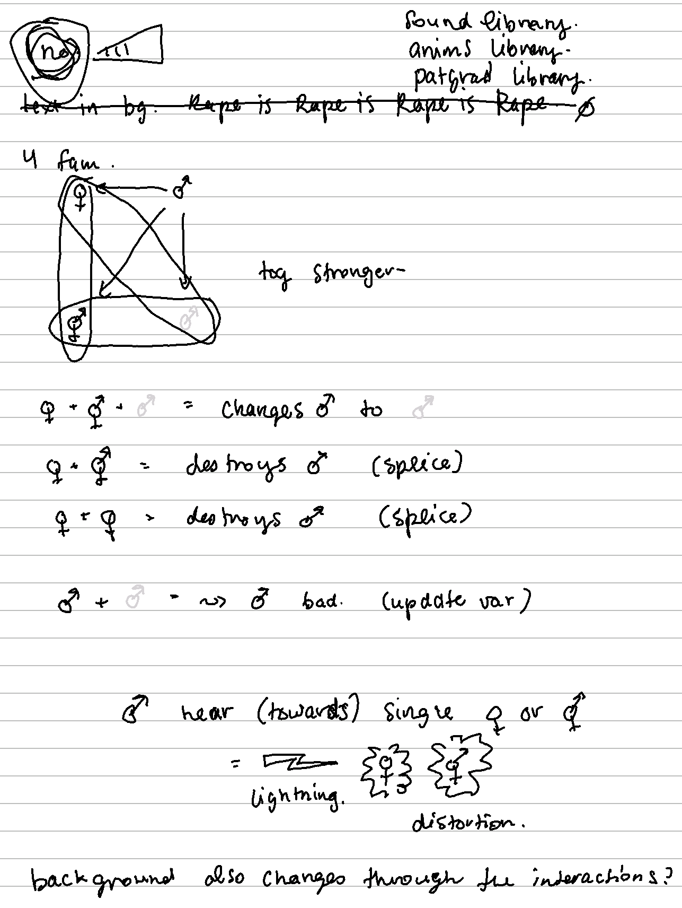

# Sense of Violence
## by Carolie Delisle (40179876)

This project was based on "personality sets" that were provided in class, mine was **Violent and Scary**
At first, I struggled with the idea, not being violent or scary in anyway, I considered what did I find violent and/or scary. 

What came to mind was the violence to women or marginalized groups, but then the allyship that emerges through persecution. (yeah.. kind of a silver lining kind gal.. sometimes..)

I started researching images and text, about sensual representation of violence, color palettes, smell, shapes and stubbled upon the poem *Sense Violence* by Helena Boberg. (It can be found on this project's main folder if you have time and interest.)

Here I've added my hand notes from my pad, going from ideation, to research to semi-coding. 
The current version is not what I wanted it to be but.. it is something. 

